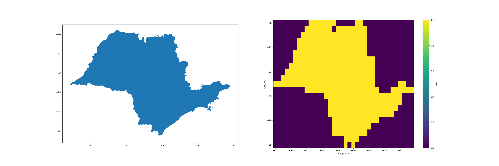

# Geo-Mask

Is a python-based module that provides tools for point-clipping and shape-based masking of geospatial datasets.
The core focus is on using `numpy`, `xarray`, and `shapely` to enable efficient spatial data operations.

## Usage

```python
from masker import create_mask_dataset

ds: xr.Dataset = create_mask_dataset(polygon, mesh_resolution=0.25)
```


